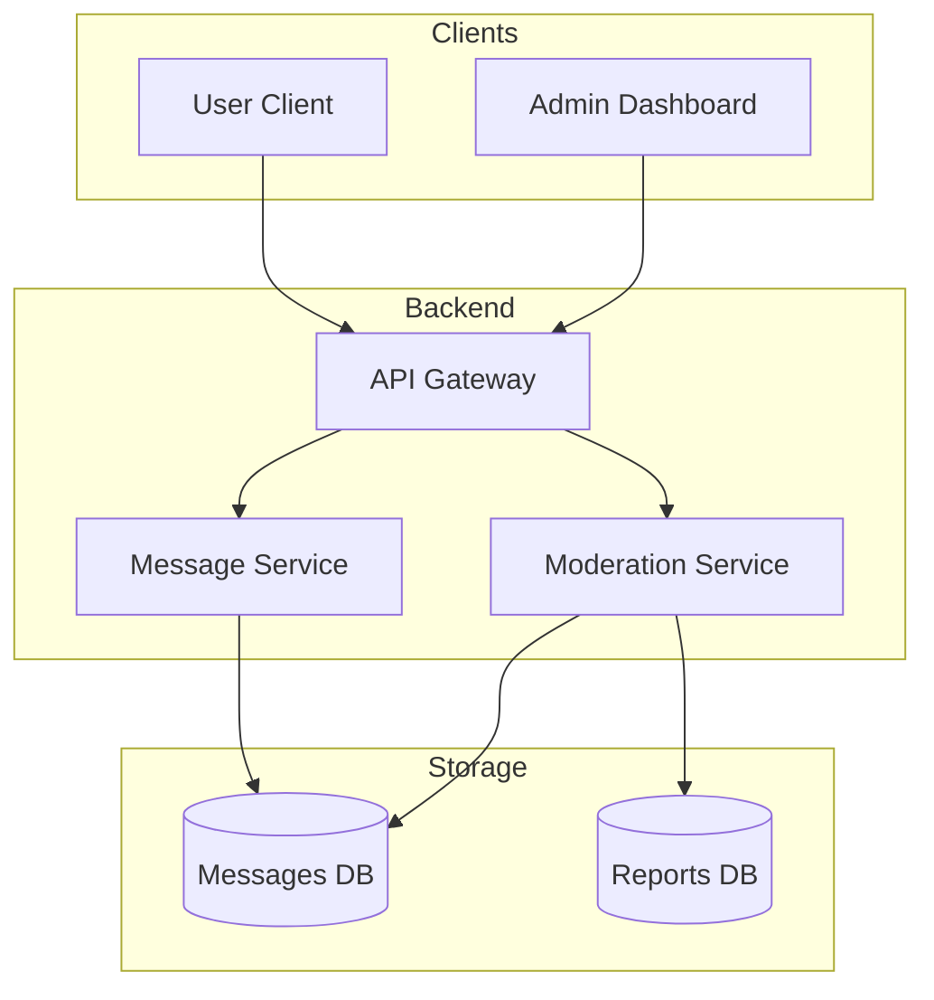

# 🧪 Laboratory Work 1: Messenger System Design
## Variant 10: Moderation & Reporting

**Student:** Artem Bereznii
**Focus:** Business logic, governance, and audit trails.

---

## 🧱 Part 1 — Component Diagram

This diagram shows the separation between the core messaging flow and the moderation governance flow.



  ---

## 🔁 Part 2 — Sequence Diagram

Scenario: A user reports a message, and a moderator hides it.

```mermaid
sequenceDiagram
  participant U as User B (Reporter)
  participant API as API Gateway
  participant Mod as Moderation Service
  participant DB as Reports DB
  participant M as Moderator

  U->>API: POST /messages/{id}/report
  API->>Mod: handleReport(reason)
  Mod->>DB: createReport(msgId, reporterId)
  Mod-->>API: 202 Accepted
  API-->>U: "Report submitted"

  Note over Mod, M: Asynchronous Notification
  Mod->>M: Notify: New Report Pending
  M->>API: POST /reports/{id}/resolve (Action: HIDE)
  API->>Mod: resolveReport(id, HIDE)
  Mod->>DB: updateStatus(RESOLVED)
  Mod->>MDB: updateMessage(id, isHidden=true)
  ```

  ---

## 🔄 Part 3 — State Diagram

Entity: Message (with Moderation logic)

```mermaid
stateDiagram-v2
  [*] --> Created
  Created --> Sent
  Sent --> Reported
  
  state Reported {
    [*] --> PendingReview
    PendingReview --> UnderReview
  }
  
  UnderReview --> Hidden: Content Violated Policy
  UnderReview --> Sent: Dismissed (False Positive)
  
  Hidden --> [*]
```  

## 📚 Part 4 — ADR (Architecture Decision Record)

```markdown
# ADR-001: Use Soft Delete for Moderated Content

## Status
Accepted

## Context
When a message is reported and found to violate terms of service, it must be removed from public view. 
However, we need to maintain a history for legal compliance and potential user appeals.

## Decision
We will implement Soft Deletion. Instead of removing the row from the Messages DB, we will use a boolean flag is_hidden and a moderation_reason column. 
The API Gateway/Message Service will filter out any messages where is_hidden = true for standard user requests.

## Alternatives
- Hard Delete: Irreversibly remove data (rejected due to lack of audit trail).
- Archive Table: Move moderated messages to a separate "Jail" database (considered, but adds complexity to data joins).

## Consequences
+ Audit trail maintained for appeals.
+ Faster "deletion" (simple update query).
- Database size grows over time as rows are never truly deleted.
- Developers must remember to include WHERE is_hidden = false in all client-facing queries.
```

---
