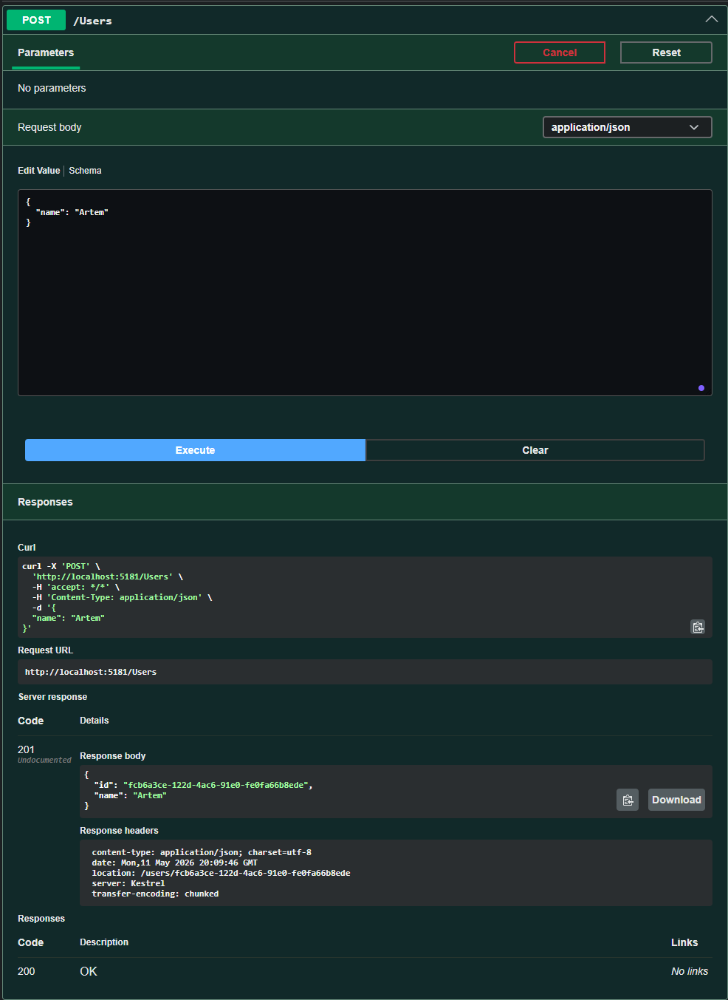
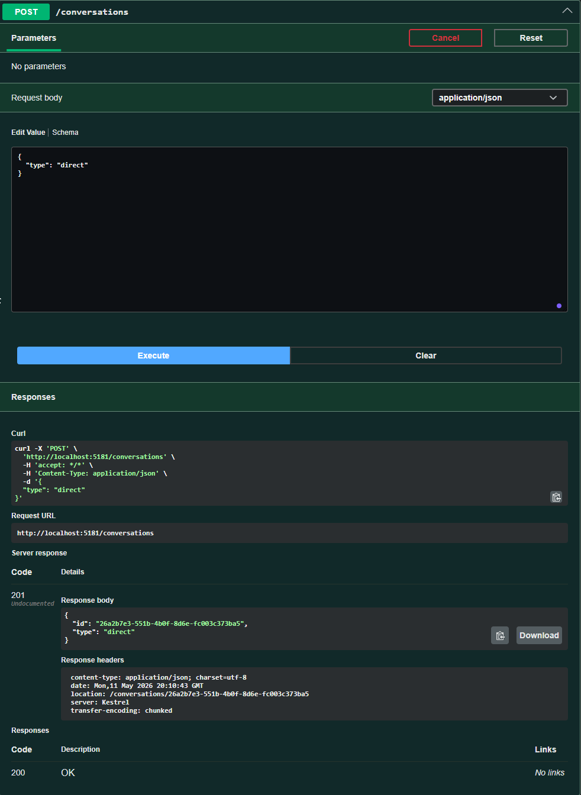
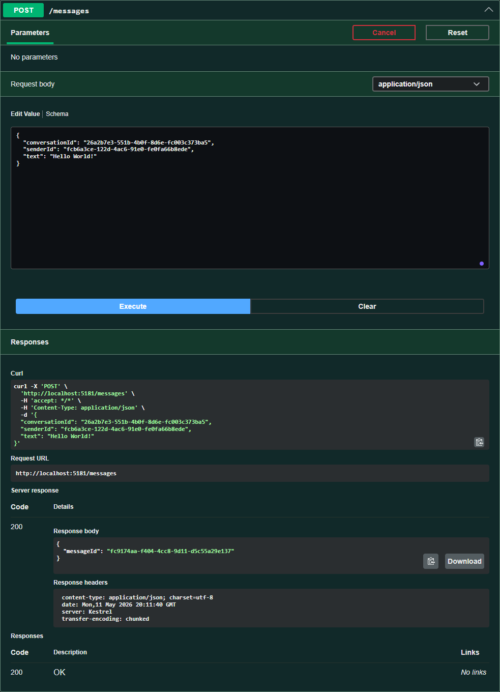
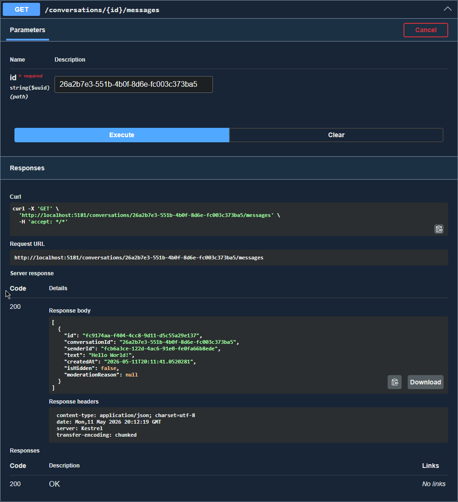
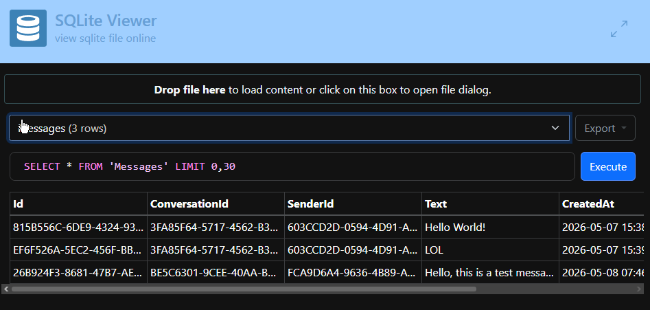

# Laboratory Work 4: Debugging & Demonstration
**Messenger API - ASP.NET Core Implementation**

This document provides a detailed audit of the debugging process and a functional demonstration of the minimal messenger system and its Variant 10 moderation features.

---

## Part 1: Debugging Audit

During the development of the messenger architecture, several syntax and logical errors were identified and resolved using the Visual Studio debugger and integration testing logs.

| Type | Description of Found Error | Method of Resolution (Fix) |
| :--- | :--- | :--- |
| **Syntax** | **Missing namespace reference (`CS0246`).**   The compiler could not locate the `Conversation` and `Message` model classes within `ConversationsController.cs`.    *See image: [Syntax Error 1](./images/bug1-missing-namespace.png)* | Hovered over the unrecognized class name and used Visual Studio Quick Actions to import the missing namespace: `using Messenger.Api.Models;`. |
| **Syntax** | **Type mismatch (`CS0019`).**   Attempted to compare a database `Guid` with a `string` payload in a LINQ query inside `MessagesController.cs`.    *See image: [Syntax Error 2](./images/bug2-type-mismatch.png)* | Reverted the DTO property type from `string` back to `Guid` to ensure strict type safety before querying the Entity Framework context. |
| **Logical** | **"Phantom 404" Routing Conflict.**   During integration testing, the `GetMessages` endpoint failed to resolve. It was placed in the wrong controller with conflicting base routes (`/messages/conversations/{id}/messages`).    *See image: [Logical Error 1](./images/bug3-phantom-404.png)* | Refactored architecture to strictly align with REST principles. Moved the endpoint to `ConversationsController` and applied the `{id:guid}` constraint to ensure strict parameter binding. |
| **Logical** | **Potential `ArgumentNullException` Crash.**   The delete endpoint attempted to remove a message without verifying if the database query actually returned a valid entity first.    *See image: [Logical Error 2](./images/bug4-null-reference.png)* | Used the Visual Studio debugger (Locals window) to inspect the `null` state during a bad request. Added an `if (message == null)` guard clause to return a `404 NotFound` gracefully. |
| **Logical** | **Business Logic Failure in Moderation.**   The moderation "DELETE" action was merely flagging `IsHidden = true` (Soft Delete) instead of physically removing the database row (Hard Delete).    *See image: [Logical Error 3](./images/bug5-broken-delete.png)* | Stepped through the execution path using breakpoints (F10). Replaced the incorrect soft-delete assignment with the correct Entity Framework command: `_context.Messages.Remove(message);`. |

---

## Part 2: Functional Showcase (Workflow Overview)

Below is the complete, step-by-step workflow of the Messenger API, demonstrating strict relational entity creation, message persistence, and history retrieval.

### 1. User Creation
A new user is created in the system. The API returns a `201 Created` status along with the generated UUID, which acts as the primary key for relational mapping.

### 2. Conversation Initialization
A new conversation thread is initialized. The system requires a valid conversation ID before any messages can be sent, ensuring relational integrity.

### 3. Sending a Message
A message payload is submitted containing the `senderId`, `conversationId`, and the text. The API validates that both the user and the conversation exist before committing the message to the database.

### 4. Retrieving Message History
A GET request fetches the conversation history. The system successfully retrieves the persisted message, proving that data is securely stored and mapped correctly.

### 5. Database Persistence Proof
A direct view of the embedded SQLite database proving that the Entity Framework successfully mapped the C# models to relational tables and stored the exact payload.

---

## Part 3: Defense Questions

**1. What is debugging and how does it differ from testing?**
Testing is the process of finding out *if* a bug exists (e.g., an integration test failing). Debugging is the subsequent process of finding exactly *where* and *why* it exists, and applying the fix.

**2. What is the difference between a syntax error and a runtime error?**
A syntax error violates the rules of the programming language (e.g., missing semicolons, type mismatches) and prevents compilation. A runtime error occurs when valid code attempts an impossible operation while running (e.g., dividing by zero, null reference exceptions), causing a crash.

**3. What is a logical error and why is it the hardest to find?**
A logical error occurs when the code compiles and runs without crashing, but produces the wrong business outcome (e.g., adding instead of subtracting). They are difficult to find because the compiler does not flag them—the computer assumes you meant to write that logic.

**4. Name three debugging tools, their advantages, and disadvantages.**
* **Visual Studio Debugger:** Excellent IDE integration and memory inspection, but can be heavy on system resources.
* **Postman:** Fantastic for API routing and payload debugging, but cannot inspect backend memory or C# variables.
* **Console Logging / Swagger:** Great for quick, lightweight visual checks, but inefficient for tracking complex object states over time.

**5. What is a bug?**
An error, flaw, or unexpected behavior in a program that produces an incorrect result, fails to meet business requirements, or crashes the application.

**6. What is a Call Stack and how does it help with debugging?**
A Call Stack is a list showing the exact sequence of active subroutines or method calls that led to the current point in execution. If an app crashes deep in the database layer, the call stack reveals which specific controller endpoint originally triggered the crash.

**7. What is a Breakpoint?**
A deliberate marker placed on a line of code that instructs the debugger to pause program execution, allowing the developer to inspect memory, variables, and the application state at that exact moment.

**8. What are Data Breakpoints and Function Breakpoints?**
A Function Breakpoint pauses execution whenever a specific method is called. A Data Breakpoint pauses execution exactly when the value of a specific variable changes in memory, regardless of which line of code caused the change.

**9. What is "Rubber Duck Debugging"?**
A psychological debugging technique where a programmer explains their code, line-by-line, to an inanimate object (like a rubber duck). The act of vocalizing the logic often helps the developer realize their own flawed assumptions.

**10. What is Print-Debugging?**
The method of inserting `Console.WriteLine()` or logging statements throughout the code to track variable values and execution flow, rather than using an interactive step-through debugger.

**11. What is the Bisection (Binary Search) method in debugging?**
Isolating a bug in a large file by commenting out half the code. If the bug disappears, it existed in the commented half. This halving process is repeated until the exact broken line is isolated.

**12. What is Tracing and how does it differ from stepping?**
Tracing involves recording a log of events and state changes as the program runs at full speed for later analysis. Stepping is manually pausing the program and moving through it one line of code at a time in real-time.

**13. What is Post-mortem debugging?**
Analyzing a memory dump, core dump, or error log after an application has already crashed and terminated. This is primarily used for diagnosing production server crashes where live debugging isn't possible.

**14. What is Time Travel Debugging (Reverse Debugging)?**
An advanced feature that records the entire execution trace of a program, allowing the developer to step *backwards* in time to inspect the state immediately before an error occurred, rather than repeatedly restarting the application.

**15. What is program logging and what are its levels?**
Logging is the practice of recording application events to a file or console. Standard levels include:
* **Trace/Debug:** Deep technical details for developers.
* **Info:** Normal application milestones (e.g., "User logged in").
* **Warning:** Unexpected events where the application successfully recovered.
* **Error/Fatal:** Critical failures or crashes requiring immediate attention.